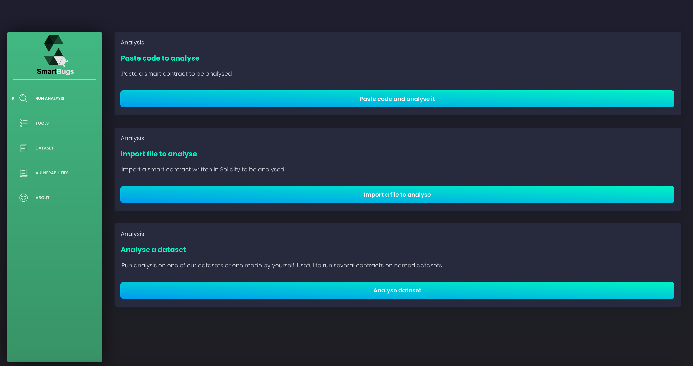

# SmartBugs Dashboard

SmartBugs is an execution framework aiming at simplifying the execution of analysis tools on datasets of smart contracts.

## Features

- A plugin system to easily add new analysis tools, based on Docker images;
- Parallel execution of the tools to speed up the execution time;
- An Output mechanism that normalizes the way the tools are outputting the results, and simplify the process of the output across tools.

## Supported Tools

1. HoneyBadger
2. Maian
3. Manticore
4. Mythril
5. Osiris
6. Oyente
7. Securify
8. Slither
9. Smartcheck
10. Solhint

## Usage

The first step is to clone [SmartBugs Dashboard's repository](https://github.com/smartbugs/smartbugs-dashboard):

```
git clone https://github.com/smartbugs/smartbugs-dashboard.git
```

Then run:

```
npm install
npm run smartbugs
```

## Screenshot



## Known Limitations

When running a tool the user must be aware of the solc compatibility. Due to the major changes introduced in solidity v0.5.0, we provide the option to pass another docker image to run contracts with solidity version below v0.5.0. However, please note that there may still be problems with the solidity compiler when compiling older versions of solidity code.

## Smart Contracts dataset

We propose two dataset a smart contract dataset with SmartBugs.
The first dataset contains 69 annotated contracts to evaluate the accuracy of analysis tools.
The second dataset contains 47,518 unique contract from the Ethereum network.

The results of the analysis on 47,587 contracts is available here: https://github.com/smartbugs/smartbugs-wild

### SB Curated

SB Curated provides a collection of vulnerable Solidity smart contracts organized according to the [DASP taxonomy](https://dasp.co). It is available in the `dataset` repository.

| Vulnerability                                                                                                     | Description                                                                        | Level      |
| ----------------------------------------------------------------------------------------------------------------- | ---------------------------------------------------------------------------------- | ---------- |
| [Reentrancy](https://github.com/smartbugs/smartbugs/blob/master/dataset/reentrancy)                               | Reentrant function calls make a contract to behave in an unexpected way            | Solidity   |
| [Access Control](https://github.com/smartbugs/smartbugs/blob/master/dataset/access_control)                       | Failure to use function modifiers or use of tx.origin                              | Solidity   |
| [Arithmetic](https://github.com/smartbugs/smartbugs/blob/master/dataset/arithmetic)                               | Integer over/underflows                                                            | Solidity   |
| [Unchecked Low Level Calls](https://github.com/smartbugs/smartbugs/blob/master/dataset/unchecked_low_level_calls) | call(), callcode(), delegatecall() or send() fails and it is not checked           | Solidity   |
| [Denial Of Service](https://github.com/smartbugs/smartbugs/blob/master/dataset/denial_of_service)                 | The contract is overwhelmed with time-consuming computations                       | Solidity   |
| [Bad Randomness](https://github.com/smartbugs/smartbugs/blob/master/dataset/bad_randomness)                       | Malicious miner biases the outcome                                                 | Blockchain |
| [Front Running](https://github.com/smartbugs/smartbugs/blob/master/dataset/front_running)                         | Two dependent transactions that invoke the same contract are included in one block | Blockchain |
| [Time Manipulation](https://github.com/smartbugs/smartbugs/blob/master/dataset/time_manipulation)                 | The timestamp of the block is manipulated by the miner                             | Blockchain |
| [Short Addresses](https://github.com/smartbugs/smartbugs/blob/master/dataset/short_addresses)                     | EVM itself accepts incorrectly padded arguments                                    | EVM        |
| [Unknown Unknowns](https://github.com/smartbugs/smartbugs/blob/master/dataset/other)                              | Vulnerabilities not identified in DASP 10                                          | N.A        |

### SB Wild

SB Wild is available in a separated repository due to its size: https://github.com/smartbugs/smartbugs-wild

## Browser Support

At present, we officially aim to support the last two versions of the following browsers:

    

## Dashboard Template

[Vue-Black Dashboard](https://demos.creative-tim.com/vue-black-dashboard)
